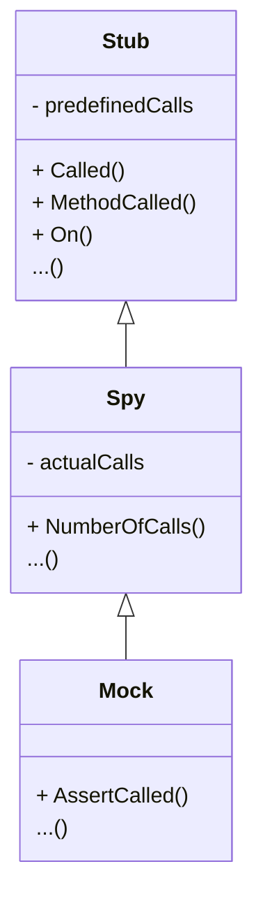

- Date: 2024-06-25
- Decision taken by: Laurent DUTHEIL
- Status: Accepted

# Context

If we refer to a definition of [test doubles](https://martinfowler.com/bliki/TestDouble.html), there is an interest in distinguishing stubs, spies and mocks.

**Stubs** provide canned answers to calls made during the test. For example, a stub needs to return a value in response of a query. If the code under test changes and no longer needs to make that
query, there is no reason that the test should break.

**Spies** are stubs that also record some information based on how they were called. One form of this might be an email service that records how many messages it was sent.

**Mocks** are pre-programmed with expectations which form a specification of the calls they are expected to receive. They can throw an exception if they receive a call they don't expect and are
checked during verification to ensure they got all the calls they were expecting.

We can see the relation between them as:

- a Stub handles the predefined calls.
- a Spy is a Stub who records the actual calls.
- a Mock is a Spy who can make assertions and fail the tests on error.

# Considered options

1. Separate Stub, Spy and Mock in different structure:
    - ✅ **Advantage:**
        - respect of the [Separation of Concerns](https://en.wikipedia.org/wiki/Separation_of_concerns)
        - Stub and Spy don't fail the test if a method is not called
        - we can remove the methods `Maybe()` and `Unset()`
        - encourage to explicite the use of Stub, Spy or Mock in tests
    - 🚫 **Disadvantage:**
        - can break some behaviour from the previous version (the `On()` method does not panic if the stub method have no return parameters)
2. Keep the notions in the same structure:
    - ✅ **Advantage:**
        - all in one file
    - 🚫 **Disadvantage:**
        - maintainability
        - misunderstand the behaviour of a stub, a spy and a mock

# Decision

Option 1: Separate Stub, Spy and Mock in different structure

